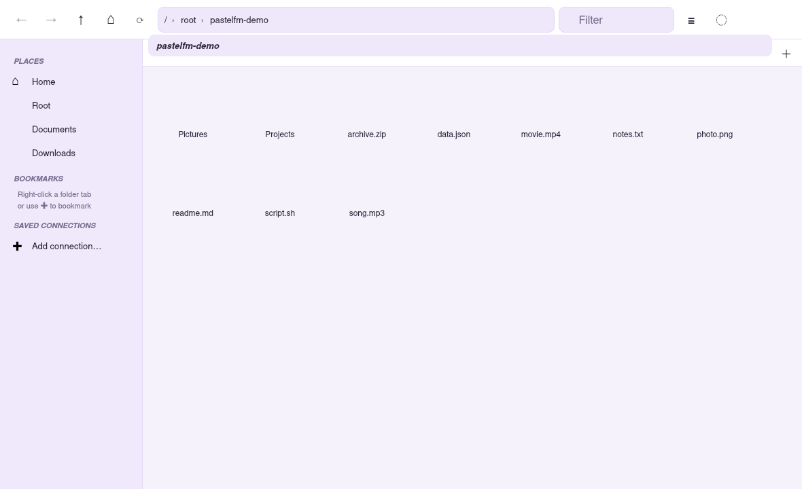

# PastelFM

A modern, pastel-themed desktop file manager built with **Qt 6 / QML**. It has
tabbed browsing, sidebar bookmarks, saved connection profiles, full file
operations, vim-style keyboard navigation, and mounts **remote SSH (SFTP/sshfs)**
and **Samba (SMB/CIFS)** shares. Runs natively on both **Wayland and Xorg**.



## Features

- **Pastel themes** — Lavender, Mint, Peach, Sky, Rosé, Sakura, each with a light
  and dark variant. Pick via the 🎨 button; the choice persists.
- **Tabs** — multiple folders open at once, each with its own back/forward history.
- **Sidebar** — Places, Bookmarks, Saved Connections, and live Mounts.
- **File operations** — copy, cut, paste, rename, new folder/file, move to Trash
  (via `gio`), permanent delete, and a Properties dialog. Bulk copy/move/delete
  run on a worker thread so the UI stays responsive.
- **Grid & list views**, folders-first sorting, hidden-file toggle, live filter.
- **Remote mounting (auto-detect):**
  - **SSH** — prefers userspace `gio mount sftp://…` (gvfs); falls back to native
    `sshfs` when gvfs is unavailable.
  - **Samba** — `gio mount smb://…` (gvfs), staying userspace (no root).
  - Mounted shares appear as ordinary paths, so browsing them "just works".

## Requirements

- Qt 6.5+ (`Quick`, `QuickControls2`, `Concurrent`), CMake 3.21+, a C++17 compiler.
- For remote mounts: **gvfs** (recommended, userspace) — provides `gio`. Optionally
  `sshfs` for the native SSH fallback, and `cifs-utils` for native Samba (needs root).
- A color-emoji font (e.g. `noto-fonts-emoji`) for the file-type icons.

On Arch:
```sh
sudo pacman -S qt6-base qt6-declarative cmake gcc gvfs sshfs noto-fonts-emoji
```

## Build & run

```sh
cmake -B build -DCMAKE_BUILD_TYPE=Release
cmake --build build -j
./build/pastelfm            # optionally: ./build/pastelfm /path/to/open
```

The same binary runs on Wayland and Xorg; Qt picks the platform automatically.
Force one with `QT_QPA_PLATFORM=wayland` or `QT_QPA_PLATFORM=xcb`.

## Keyboard shortcuts

### Global
| Key | Action |
| --- | --- |
| `Ctrl+T` / `Ctrl+W` | New tab / close tab |
| `Ctrl+L` | Connect to server (SSH/Samba) |
| `Ctrl+D` | Bookmark / unbookmark current folder |
| `Ctrl+H` | Toggle hidden files |
| `F5` | Refresh |
| `Ctrl+V` | Paste |

### Vim-style (in the file view)
| Key | Action |
| --- | --- |
| `j` / `k` | Move cursor down / up (a row) |
| `h` | Go to parent folder |
| `l` / `Enter` | Open / enter the item under the cursor |
| `gg` / `G` | Jump to first / last item |
| `Space` | Toggle multi-selection, advance cursor |
| `y` / `d` / `p` | Yank (copy) / cut / paste |
| `r` | Rename item under the cursor |
| `a` or `n` | New folder |
| `x` / `Delete` | Move selection to Trash |
| `u` | Refresh |
| `/` | Focus the filter box |
| `Esc` | Clear selection |

## Notes

- **Passwords are never stored.** Saved connections keep host/user/path only;
  you're prompted (via gvfs) when needed, or key-based auth is used.
- Right-click a bookmark / saved connection / mount in the sidebar to remove or
  unmount it.
- `PASTELFM_START=/path` or a path argument opens PastelFM at that location.

## Project layout

```
CMakeLists.txt          Qt6 build (qt_add_qml_module; Theme.qml is a singleton)
src/                    C++ backend
  main.cpp              engine bootstrap, Material style, HiDPI, app id
  FileSystemModel.*     directory listing model (+ QFileSystemWatcher)
  FileOperations.*      copy/move/delete/rename/trash on a worker thread
  MountManager.*        SSH/Samba mounting (gvfs → sshfs/cifs), mount list model
  SettingsStore.*       bookmarks, connections, theme (QSettings; no secrets)
qml/
  Main.qml, Toolbar.qml, Sidebar.qml, FileView.qml, Theme.qml (pastel palettes)
  components/           buttons, dialogs, file delegate, theme picker
```
